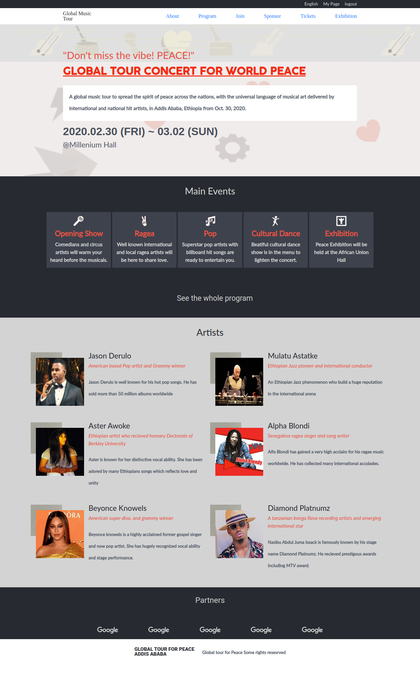
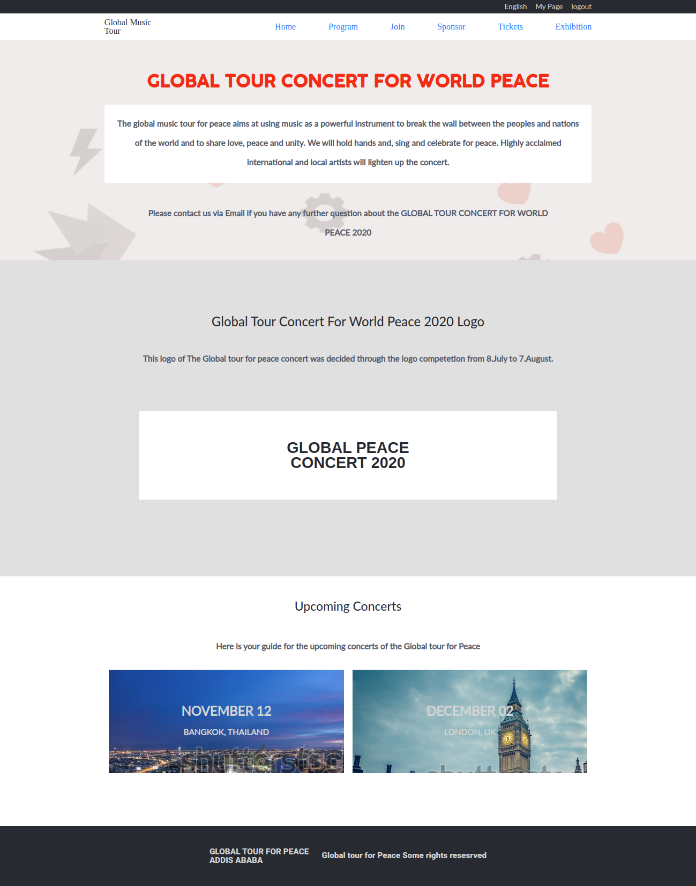
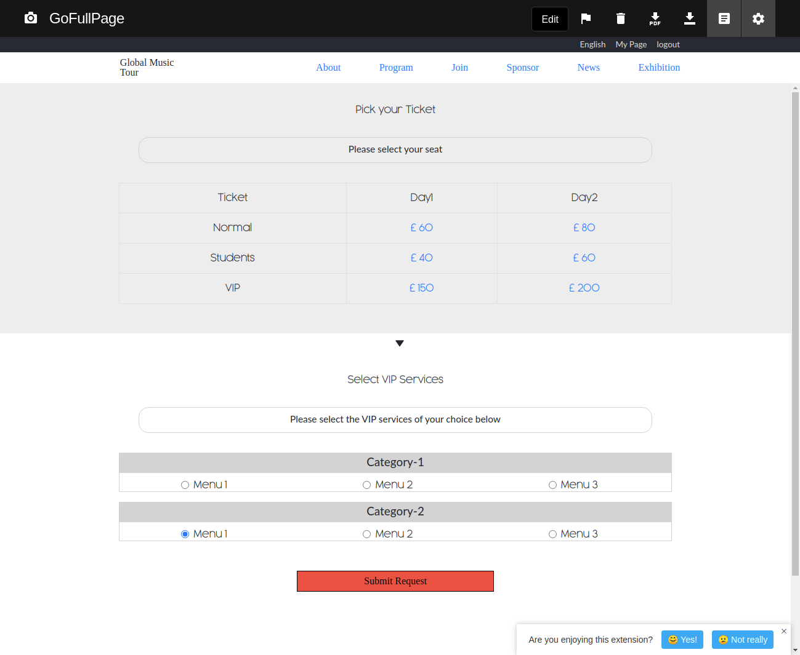

# HTML-CSS-Capstone-Project
## About the Project 
This is an HTML/CSS Capstone project to design a website by personalizing an archived conference website design of 'CREATIVE COMMONS GLOBAL SUMMIT 2015' with the given client's requirements. 

The website has The home page, the about page, and the tickets page. Responsive design is applied for the small screen and large screen with a min-width of 768px, a single breakpoint.

### Home Page 
The home page has a navbar, front section, main events section, artists section, and footer section
  - Navbar has a responsive feature. The small screen nav bar has only the dropdown menu element, 
  which displays the navigation links with hover action. The navbar for a larger screen has two sections. The first navbar displays the social media links, user and logout icons. 

  - Front section has the concert title, concert info, date, and concert place. The concert title is displayed in big font. 

  - The main events section has articles that give general information about the program types. The article elements have 100% width in a small screen, whereas they are laid out in display flex in larger screens within the parent class. Each article has the same feature with a self-descriptive icon, article header, and description. The elements are laid out in display-flex with a flex-direction row in small screens and a column in larger screens. 

  - Artists section has articles of similar features with artist's photos, name, affiliations, and about info. The child elements inside the articles flex-displayed the photo and a div element wrapping the other child elements. The articles have 100% width on small screens and are displayed flex row wrap in bigger screens with 50% width each. The photo has a custom behind-decoration element which is made by an absolute-positioned image element of less z-index than the main image. 
  
  - The footer has two sections, which are the partners and the copyright section. The partner section has the logos of partner organizations. The copyright has the concert logo and copyright statement. 

 
  ### About Page 
  The about page has a navbar, front section, contact section, logo section, upcoming-events section, and footer section.
  - Navbar is the same as the home page

  - The front section is almost similar to the front section on the home page with a little more detailed description of the concert.  

  - The upcoming section is a guide to the upcoming concerts. It has an upcoming header, upcoming info, and articles which has descriptive background images and the upcoming concert date and place. The articles have 100% width on small screens and they are flex-displayed with 50% width each in larger screens. 

  - The footer is the same as that of the home page with a little difference in spacing. It has a responsive feature in which the partners' section is displayed-none on larger screens.   

  ### Tickets page 
  The ticket page has a ticket section and VIP services section with a down-pointing arrow section between them.
  - The ticket section has the header, a rounded bordered element with a description, and a table to pick the tickets from. The table has a Ticket for different days and with a category of normal, student, and VIP.  
  - The VIP services section has a rounded border element with description and other bordered elements with a service menu to pick from. 
  - The submit button has a variable color, $color-red background. 

  ### Stylings 
  SASS and Bootstrap frameworks are used for the stylings of different sections and elements of the page. 
  Partial SCSS files are used for color, fonts, and @mixin collections
   - color partial SCSS file defines three color variables based on the client requirement 
   - Font partial SCSS files define 9 font sizes defined as ratios of the single variable font size. Seven font-weight variables are also defined. 
  The mixins partial SCSS element defines @mixin abstractions for custom fonts, custom boxes, custom buttons, and custom borders. Math and logic functions are employed to define some of the @mixin abstractions. 

  ### Cool features 
  This website design incorporates responsive typography by mathematically define all the font sizes in terms of few variables which can be easily manipulated, which simplifies maintenance and design flexibility greatly. 
  The design also has a dedicated partial SCSS file for slider background which gives the pages a descriptive and visually attractive element. 
  Background images for the slider background and the front section are custom-created using an online vector design tool. 
  Icons used in the events sections of the home page are also purely developed vector images using an online vector design tool. 
  
## Built With

- HTML5
- CSS3
- SCSS 
- Bootstrap4

## Live Demo

[Live Demo Link](https://henatan99.github.io/HTML-CSS-Capstone-Project/) 

## Getting Started

**Just clone this repo and open the index.html file in your browser then you are good to go.**

**To get a local copy up and running follow these simple example steps.**

### clone the repo.

## Authors

👤 **Henok Mossissa**

- GitHub: [@henatan99](https://github.com/henatan99)
- Twitter: [@henatan99](https://twitter.com/henatan99)
- LinkedIn: [Henok Mossissa](https://www.linkedin.com/in/henok-mekonnen-2a251613/)

## 🤝 Contributing

Contributions, issues, and feature requests are welcome!

## Show your support

Give a ⭐️ if you like this project!

## Acknowledgments

- Some icons used from [iconify](https://iconify.design/)

## 📝 License

This project is [MIT](./LICENSE) licensed. 
